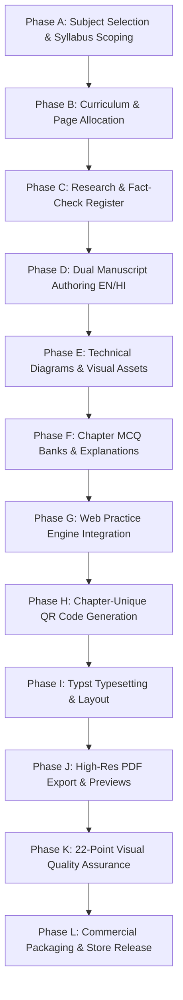

# RTechLab AI Digital Publishing Engine — 12-Phase Pipeline

```mermaid
flowchart TD
    A[Phase A: Subject Selection & Syllabus Scoping] --> B[Phase B: Curriculum & Page Allocation]
    B --> C[Phase C: Research & Fact-Check Register]
    C --> D[Phase D: Dual Manuscript Authoring EN/HI]
    D --> E[Phase E: Technical Diagrams & Visual Assets]
    E --> F[Phase F: Chapter MCQ Banks & Explanations]
    F --> G[Phase G: Web Practice Engine Integration]
    G --> H[Phase H: Chapter-Unique QR Code Generation]
    H --> I[Phase I: Typst Typesetting & Layout]
    I --> J[Phase J: High-Res PDF Export & Previews]
    J --> K[Phase K: 22-Point Visual Quality Assurance]
    K --> L[Phase L: Commercial Packaging & Store Release]
```
